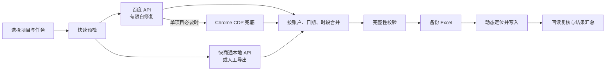

<p align="center">
  
</p>

<p align="center">
  
</p>

<h1 align="center">蚁之力 · 竞价数据自动化</h1>

<p align="center">
  <strong>让竞价数据从读取、校验到安全入表，全程自动完成</strong><br>
  面向 Windows 10/11 的百度竞价小时报与日报工作台
</p>

<p align="center">
  
  
  
  
</p>

<p align="center">
  <a href="#产品一览">产品一览</a> ·
  <a href="#从数据到报表">工作流程</a> ·
  <a href="#核心能力">核心能力</a> ·
  <a href="#快速开始">快速开始</a> ·
  <a href="#可靠性与安全">可靠性与安全</a> ·
  <a href="#发布与更新">发布更新</a> ·
  <a href="#深入了解">深入了解</a>
</p>

---

## 产品一览

<p align="center">
  
</p>

<p align="center"><sub>v2026.7.31.118 桌面工作台：项目、数据模式、小时报、日报、当前流程与实时日志集中在一个窗口。</sub></p>

<table>
  <tr>
    <td width="25%" valign="top">
      <strong>API 优先</strong><br><br>
      百度 API 有限自修复，单项目失败后才整体降级 Chrome。
    </td>
    <td width="25%" valign="top">
      <strong>本地数据</strong><br><br>
      快商通只读 API 绑定回环地址，严格按推广 ID 路由。
    </td>
    <td width="25%" valign="top">
      <strong>Excel 安全</strong><br><br>
      备份、动态定位、写后复核，不重建工作簿。
    </td>
    <td width="25%" valign="top">
      <strong>多项目调度</strong><br><br>
      最多 3 个项目，百度并行、Excel 串行。
    </td>
  </tr>
</table>

**蚁之力 · 竞价数据自动化**是一套在 Windows 本地运行的百度竞价小时报与日报工作台。同事选择项目、时段或日期后，程序负责读取、校验、合并、备份、写入、复核和结果汇总。

> 当前版本不做 QQ/微信自动发送，不操作快商通客户端，不做 OCR，不自动截图发送，也不把业务数据交给外部 AI 分析服务。

## 从数据到报表



单项目按同一条链路完成数据准备与安全入表；任何必须完整成功的阶段失败，都会按既定边界停止或降级，不拼接半套结果。

## 核心能力

| 模块 | 能力 | 关键边界 |
|:--|:--|:--|
| 百度数据 | API 优先，单项目必要时由 Chrome CDP 兜底 | Token 最多刷新 1 次、网络额外重试 2 次、完整性额外读取 1 次，总预算 20 秒 |
| 快商通数据 | 默认使用本地只读 API，可显式切换人工导出 | 自动兼容 Electron 与旧 Java/JCEF 客户端；按推广 ID 唯一路由，失败或不完整时指标按 0，不偷读旧导出 |
| 小时报 | 处理 11 点、15 点和 18 点报表 | 百度、快商通、合并、Excel 写入阶段可追踪 |
| 日报 | 默认处理昨天，也可指定日期 | 等待表格快照稳定并做基础完整性校验，不使用超时前的早期残值 |
| 多项目 | GUI 可选择 1–3 个项目 | 仅百度 API 并行准备；快商通、合并和 Excel 写入按选择顺序串行，不降级浏览器 |
| 桌面工作台 | GUI、托盘与小螃蟹状态提示 | 实时日志、历史日志、单实例与任务状态反馈 |
| 在线更新 | 通过 GitHub Release 获取程序更新 | 更新程序文件，不覆盖用户配置、凭据和运行数据 |

## 快速开始

<details open>
<summary><strong>同事电脑首次安装</strong></summary>

新电脑只分发完整安装器：

```text
Hourlyreport_automation_setup_v2026.7.31.118.exe
```

安装器会部署程序、默认项目配置、桌面快捷方式和开始菜单入口。首次启动会检查运行环境；缺少环境时安装隔离的项目专用 Python 3.14.5，不修改系统 Python，也不要求卸载电脑已有版本。

真实账号密码和 OAuth Token 不进入安装器，由管理员通过 `.baidu-secrets` 配置包导入。
</details>

<details open>
<summary><strong>GUI 日常操作</strong></summary>

1. 双击 `hourlyreport_automation.exe`，选择单项目，或切换多项目并按顺序选择 1–3 个项目。
2. 选择数据模式：单项目可用 `A > B`（API 优先）或 `B > A`（强制浏览器）；多项目固定为 API-only，不提供 `B > A` 或浏览器降级。
3. 小时报选择 11 点、15 点或 18 点；日报使用昨天或指定日期。
4. 启动任务，查看“当前流程”和“实时日志”。
5. 完成后核对结果汇总，并按系统设置打开目标 Excel。

多项目组合会自动记住，下一次切换到多项目时可继续使用。
</details>

<details>
<summary><strong>HERMES / 夏思道固定入口</strong></summary>

自动代执行必须使用固定 BAT：

```cmd
run_hermes_hourly.bat 11点
run_hermes_hourly.bat 15点
run_hermes_hourly.bat 18点
run_hermes_daily.bat
```

日报也可追加指定日期，例如 `run_hermes_daily.bat 2026-07-09`。BAT 会固定工作目录、UTF-8 环境和 `.venv` Python，并先执行快速预检。

> 不得绕过 BAT 拆分执行 `fetch`、`parse`、`merge` 或 `write`。预检失败时立即停止，不写 Excel；任务失败后不要手工补数。
</details>

## 可靠性与安全

| 边界 | 保证 |
|:--|:--|
| Excel | 写前备份、动态定位、写后复核；结构不确定立即停止 |
| 凭据 | `secretKey` 仅在 SCF；桌面端只保存独立 HMAC 客户端密钥与 OAuth Token，密码和密钥不进日志、发布包或 Git |
| 浏览器 | 默认只连接 Chrome CDP `http://127.0.0.1:9222`，不静默切 Edge |
| 失败处理 | 单项目百度 API 与浏览器均失败则停止；多项目 API 失败只跳过当前项目并汇总；快商通不完整则该项目快商通指标按 0，不拼接部分数据 |

Excel 写入不会重建工作簿，不修改无关 sheet、公式区、汇总区、截图区、非目标区域或用户模板样式；目标位置必须通过表头、账户区域和字段名称识别。写入后会回读复核并恢复筛选、保护等 UI 元数据。无法确认结构时，流程会停止并输出诊断信息。

完整安装器可以包含默认项目配置，但不包含真实 `secrets/secrets.json`、`.baidu-secrets`、日志、报告、备份、诊断包、浏览器数据或快商通导出数据。

## 发布与更新

| 项目 | 内容 |
|:--|:--|
| 当前版本 | `2026.7.31.118` |
| Release Tag | `v2026.7.31.118` |
| 在线更新 | `Hourlyreport_automation_v2026.7.31.118.zip` |
| 完整安装 | `Hourlyreport_automation_setup_v2026.7.31.118.exe` |
| 更新仓库 | [`kaiteJiang/Hourlyreport-Automation`](https://github.com/kaiteJiang/Hourlyreport-Automation) |

版本号遵循 `发布年.月.日.永久累计序号`，累计序号跨日期永久递增。在线更新包只更新程序文件，不覆盖 `configs/`、`secrets/`、`logs/`、`reports/`、`backups/`、`diagnostics/`、`kst_exports/`、`browser_profile/` 和 `runtime/`。

| 版本 | 重点 |
|:--|:--|
| `v118` | 加强新旧快商通客户端的路径发现与身份映射；重新扫描入口始终可用；百度 API 长时间无输出时给出可停止提示，并补充脱敏失败诊断 |
| `v117` | 修复 Electron 客户端持续写库被误判为数据库超时；在快商通设置中直接提供程序目录、数据目录与重新扫描入口 |
| `v116` | 快商通本地 API 支持 Electron 与旧 Java/JCEF 两类客户端；加强本机路径设置、退避重试与在线更新包数据隔离 |
| `v115` | 快商通本地 API 启动与日报读取性能优化；README 升级为面向用户的产品首页 |
| `v114` | 精简 GUI 打包依赖与发布目录；清理旧入口和开发边角料 |
| `v113` | 快商通本地 API 覆盖小时报与日报；完善多身份路由、缓存与安全认证 |
| `v112` | 修复旧客户端云端 Token 配置误判及百度阶段无法即时停止 |
| `v111` | 修复更新助手缺失模块导致“更新并重启”崩溃 |
| `v110` | 修复云端 Token 时区解析与多授权并发覆盖；更新 GitHub 用户名 |

更早版本与完整中文更新说明见 [`docs/releases/`](docs/releases/)。

## 深入了解

<details>
<summary><strong>1. 数据模式与降级策略</strong></summary>

| GUI | 配置值 | 行为 |
|:--|:--|:--|
| `A > B` | `api` | 生产默认。先走百度 API；有限自修复仍失败后，单项目整体降级浏览器 |
| `B > A` | `browser` | 强制浏览器。完全不发起 API 请求，直接连接 Chrome CDP |

GUI、HERMES 和 CLI 共享应用级配置 `baidu_data_source_preference`，缺失或无效时按 `api`。当前覆盖九个项目、十一个授权；沈阳牛和沈阳白是双来源项目，两路 API 必须全部成功后才允许合并，任一路失败都丢弃 API 临时结果并整项目降级浏览器。禁止混合 API 与浏览器的部分数据。

`test-baidu-api-readiness` 只读百度数据，不读写 Excel，也不启动 Chrome。Token 过期时，生产流程会备份并原子更新 `secrets/secrets.json`；原文件和备份均为敏感文件。
</details>

<details>
<summary><strong>2. 快商通小时报 / 日报业务口径</strong></summary>

快商通本地 API 会自动识别两类受支持客户端：Electron `OnlineWebCS.exe` / `OnlineWebCSNew.exe`（数据目录通常为 `%LOCALAPPDATA%\OnlineWebCSNew`）和旧 Java/JCEF `OnlineCS.exe`（数据目录通常为“文档”下的 `KuaiShangDataNew`）。客户端必须保持运行；程序只读识别到的数据，不会启动、控制或迁移快商通客户端。

如自动发现失败，可在 `系统 > 快商通模式` 中依次选择“选择快商通程序目录”“选择快商通数据目录”，或点击“重新扫描快商通”；选择的是目录，不是单个数据库文件。API 不可用、项目未绑定、推广 ID 映射歧义、数据不完整或数据库不兼容时，该项目快商通指标按 0 继续，百度数据照常处理，不会改读旧导出文件。API 会按 `5 秒 → 15 秒 → 30 秒 → 60 秒` 退避重试；同一原因只在首次、原因变化和每 5 分钟状态提醒时写实时日志。人工导出模式读取 Excel/CSV，可从项目配置目录、`kst_exports/` 或 `--file` 指定路径获取，并且不会启动或重试本地 API。

| 小时报字段 | 快商通标签来源 | 说明 |
|:--|:--|:--|
| 总对话 | 有访客消息的有效行 | 只统计访客消息数大于 0 的行 |
| 有效对话 | `有效-三句话` + `转潜-有效` | 不包含 `有效-一般` |
| 一般有效 | `有效-一般` | 单独统计 |
| 有效转潜 | `转潜-有效` | 同时计入有效对话 |
| 总转潜 | 包含 `转潜-` 的标签 | 全部转潜类 |

日报中，`有效-一般` 只进入“一般有效对话”，不进入“有效对话”；`转潜-有效` 同时进入“有效对话”和“有效转潜”。字段按表头识别，无法归属账户的行必须写入报告，不得静默丢弃。
</details>

<details>
<summary><strong>3. 多项目调度规则</strong></summary>

- 每次选择 1–3 个项目；重复项目或重复 Excel 路径必须在发起 API 前拒绝。
- 只并行准备各项目百度 API 数据；快商通解析、合并和 Excel 写入按选择顺序串行。
- 多项目模式固定为 API-only，不启动浏览器，也不从 API 降级浏览器。其中一个项目 API 失败时只跳过该项目，其他项目继续，并在 `reports/multi_project_run_report.json` 汇总。
- 停止请求不会中断当前项目，只从下一个排队项目开始停止；成功项目完成后可依次打开 Excel。
</details>

<details>
<summary><strong>4. 开发与排障命令</strong></summary>

```cmd
:: 环境诊断
.venv\Scripts\python.exe main.py --mode doctor

:: 小时报 / 日报快速预检
.venv\Scripts\python.exe main.py --mode preflight --quick
.venv\Scripts\python.exe main.py --mode preflight --task daily --quick

:: 百度 API 只读验收，不读写 Excel，不启动 Chrome
.venv\Scripts\python.exe main.py --mode test-baidu-api-readiness

:: 多项目小时报 / 日报
.venv\Scripts\python.exe main.py --mode run-multi --projects kunming_niu,ningbo_niu --task hourly --period 11点
.venv\Scripts\python.exe main.py --mode run-multi --projects kunming_niu,nanjing_bai --task daily --date 2026-07-21

:: 维护工具
.venv\Scripts\python.exe main.py --mode diagnostic-bundle
.venv\Scripts\python.exe main.py --mode archive-logs
.venv\Scripts\python.exe main.py --mode lock-dependencies

:: 基础测试
.venv\Scripts\python.exe -m pytest tests\test_basic.py
```

完整预检用于新项目上线、Excel 模板变更、结构识别异常或排障：

```cmd
.venv\Scripts\python.exe main.py --mode preflight
.venv\Scripts\python.exe main.py --mode preflight --task daily
```
</details>

<details>
<summary><strong>5. 工程结构与技术栈</strong></summary>

主要技术栈为 Python 3.14.5、PySide6、openpyxl、Playwright / Chrome CDP 和 GitHub Releases。

```text
hourly_report_bot_release_v0.4.4/
├─ hourlyreport_automation.exe        # 桌面主程序
├─ main.py                            # CLI 总入口
├─ menu.py                            # 控制台菜单
├─ install_env.bat                    # 首次环境安装与修复
├─ requirements-runtime.txt           # 运行依赖
├─ requirements-runtime.lock.txt      # 精确依赖锁定
├─ configs/
│  ├─ app_config.json                 # GUI 偏好、当前项目、数据模式
│  └─ projects/                       # 每项目一个 JSON
├─ secrets/
│  ├─ secrets.example.json
│  └─ secrets.json                    # 本地私有，不提交
├─ modules/
│  ├─ baidu_*                         # API、浏览器、登录态、授权
│  ├─ kst_*                           # 快商通本地 API 与导出解析
│  ├─ excel_*                         # Excel 检查、定位、写入
│  ├─ multi_project_*                 # 多项目选择、停止与调度
│  ├─ run_pipeline.py                 # 日报 / 小时报流程编排
│  ├─ preflight.py                    # 快速 / 完整预检
│  └─ maintenance.py                  # 依赖、诊断、日志维护
├─ gui/                               # PySide6 桌面界面
├─ docs/                              # SOP、设计与发布说明
├─ runtime/                           # 快商通本地 API 运行态，不提交
├─ logs/                              # 本地运行日志
├─ reports/                           # JSON / CSV 运行报告
├─ backups/                           # Excel 写入前备份
├─ diagnostics/                       # 脱敏诊断包
└─ kst_exports/                       # 快商通人工导出数据
```
</details>

<details>
<summary><strong>6. 协作开发与小螃蟹资产</strong></summary>

所有 AI Agent、自动化助手和人工维护者都必须先阅读 [`AGENTS.md`](AGENTS.md)。其中定义了 Excel 安全、凭据保护、Chrome 策略、API 降级、多项目执行、测试和发布规则。

<p align="center">
  
</p>

<p align="center"><sub>桌面宠物会跟随任务阶段切换动作，并承担轻量状态提示；它不参与业务数据处理。</sub></p>
</details>

---

<p align="center">
  
</p>

<p align="center">
  <strong>Local-first · API-first · Excel-safe</strong><br>
  <sub>Built for reliable SEM daily work on Windows.</sub>
</p>
