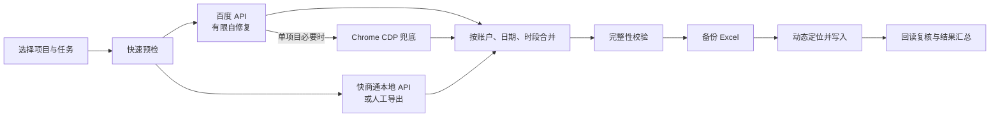

# v2026.7.28.115 Release and README Redesign Implementation Plan

> **For agentic workers:** REQUIRED SUB-SKILL: Use superpowers:subagent-driven-development (recommended) or superpowers:executing-plans to implement this plan task-by-task. Steps use checkbox (`- [ ]`) syntax for tracking.

**Goal:** 将商务通性能优化正式发布为 `2026.7.28.115`，重构面向用户的 README，并生成经过安全审计的在线更新包和完整安装器。

**Architecture:** 先修复发布打包器对根目录旧 EXE 与版本化暂存 EXE 的重复收集，再独立完成 README 信息架构重构和版本文档同步。最后由统一发布入口从干净源码构建版本化桌面 EXE、在线更新 ZIP 与 Inno Setup 安装器，并通过包清单、更新器元数据和完整测试验证后合并推送。

**Tech Stack:** Python 3.14、pytest、PyInstaller、Inno Setup 6、Markdown/HTML、Git。

## Global Constraints

- 发布版本固定为 `2026.7.28.115`，Tag 固定为 `v2026.7.28.115`。
- 在线更新包固定为 `Hourlyreport_automation_v2026.7.28.115.zip`。
- 完整安装器固定为 `Hourlyreport_automation_setup_v2026.7.28.115.exe`。
- GitHub 仓库固定为 `kaiteJiang/Hourlyreport-Automation`。
- GitHub Release 由用户手动创建；本计划只生成产物、提交并推送 `main`。
- 不运行真实 `run` / `run-daily`，不写目标 Excel。
- 不提交或打包真实凭据、OAuth Token、日志、报告、备份、诊断包、浏览器数据、快商通导出数据或 `runtime/` 本机令牌。
- 在线更新包不得包含或覆盖 `configs/`、`secrets/`、`logs/`、`reports/`、`backups/`、`diagnostics/`、`kst_exports/`、`browser_profile/`、`runtime/`。
- 完整安装器可以包含默认项目配置，但不得包含真实 `secrets/secrets.json`、`.baidu-secrets` 或本机授权数据。
- `dist/` 最终只允许保留两个当前版本发布包，不保留裸 `hourlyreport_automation.exe`。
- 用户当前修改的 `configs/` 文件和 `docs/releases/2026.7.22.109.md` 不得进入提交或发布工作树。

---

### Task 1: 保证发布包只使用版本化暂存 EXE

**Files:**
- Modify: `tools/build_release.py`
- Test: `tests/test_basic.py`

**Interfaces:**
- Consumes: `build_release(root, version, online_update|first_install|internal, artifact_dir) -> Path`
- Produces: 程序型发布包中的 `hourlyreport_automation.exe` 只来自 `artifact_dir`，同名根目录旧文件不再被递归加入。
- Preserves: 不带 `internal`、`online_update` 或 `first_install` 的普通源码包仍按现有过滤规则处理。

- [ ] **Step 1: 写失败测试，复现根目录旧 EXE 重复进入 ZIP**

在 `tests/test_basic.py` 的在线更新构建测试附近增加：

```python
def test_online_update_uses_only_staged_desktop_executable(tmp_path):
    import zipfile

    from tools.build_desktop_exe import write_build_manifest
    from tools.build_release import build_release

    root = tmp_path / "source"
    (root / "gui").mkdir(parents=True)
    (root / "gui" / "version.py").write_text(
        'CURRENT_VERSION = "2026.7.28.115"\n',
        encoding="utf-8",
    )
    (root / "main.py").write_text("print('ok')\n", encoding="utf-8")
    (root / "hourlyreport_automation.exe").write_bytes(b"stale-root-exe")
    artifact_dir = root / "build" / "release_2026.7.28.115_staging"
    artifact_dir.mkdir(parents=True)
    staged = artifact_dir / "hourlyreport_automation.exe"
    staged.write_bytes(b"fresh-staged-exe")
    write_build_manifest(root, staged, "2026.7.28.115")

    release = build_release(
        root,
        version="2026.7.28.115",
        online_update=True,
        artifact_dir=artifact_dir,
        output_dir=tmp_path / "output",
    )

    with zipfile.ZipFile(release) as archive:
        assert archive.namelist().count("hourlyreport_automation.exe") == 1
        assert archive.read("hourlyreport_automation.exe") == b"fresh-staged-exe"
```

- [ ] **Step 2: 运行测试并确认 RED**

Run:

```powershell
.venv\Scripts\python.exe -m pytest tests\test_basic.py::test_online_update_uses_only_staged_desktop_executable -q
```

Expected: 旧实现中 `hourlyreport_automation.exe` 出现两次，计数断言失败并可能输出 ZIP 重名警告。

- [ ] **Step 3: 最小修复程序型发布包文件过滤**

在 `tools/build_release.py::should_include_file()` 的 `dist` 过滤之前增加：

```python
    if (
        (internal or online_update or first_install)
        and len(parts) == 1
        and path.name.casefold() == DESKTOP_EXE.casefold()
    ):
        return False
```

暂存 EXE 仍由 `build_release()` 在遍历源码前显式写入；这里只阻止递归源码树再次写入
同名根目录文件。

- [ ] **Step 4: 运行发布过滤与打包测试**

Run:

```powershell
.venv\Scripts\python.exe -m pytest `
  tests\test_basic.py::test_online_update_uses_only_staged_desktop_executable `
  tests\test_basic.py::test_online_update_build_contains_program_but_excludes_user_data `
  tests\test_basic.py::test_first_install_build_is_standalone_but_excludes_real_secrets `
  tests\test_basic.py::test_internal_build_includes_desktop_exe_when_available `
  tests\test_kst_packaging.py -q
```

Expected: PASS，且无 `Duplicate name: 'hourlyreport_automation.exe'`。

- [ ] **Step 5: 提交 Task 1**

```powershell
git add tools/build_release.py tests/test_basic.py
git commit -m "fix: package only staged desktop executable"
```

---

### Task 2: 将 README 重构为面向用户的产品首页

**Files:**
- Modify: `README.md`

**Interfaces:**
- Consumes: 现有 `docs/images/readme-hero.webp`、`docs/images/desktop-console.png`、`assets/app_icon.png`。
- Produces: 以安装使用为主线、开发资料后置折叠的 GitHub README。
- Preserves: 百度/商务通/Excel/多项目实际规则，不创造未实现能力。

- [ ] **Step 1: 重写 Hero 与精简导航**

首屏保留横幅和图标，使用以下主文案：

```html
<h1 align="center">蚁之力 · 竞价数据自动化</h1>

<p align="center">
  <strong>让竞价数据从读取、校验到安全入表，全程自动完成</strong><br>
  面向 Windows 10/11 的百度竞价小时报与日报工作台
</p>
```

首屏只保留四个 `for-the-badge` 徽章：

- `version 2026.7.28.115`
- `Windows 10 | 11`
- `Local First`
- `Excel Safe`

导航固定为：

```text
产品一览 · 工作流程 · 核心能力 · 快速开始 · 可靠性与安全 · 发布更新 · 深入了解
```

删除第二排 Python/PySide6/openpyxl/GitHub 徽章，把技术栈放到“深入了解”。

- [ ] **Step 2: 重组用户主线**

按顺序建立以下一级标题：

```markdown
## 产品一览
## 从数据到报表
## 核心能力
## 快速开始
## 可靠性与安全
## 发布与更新
## 深入了解
```

“产品一览”保留 GUI 截图，说明文字更新为当前 v115，不再引用 v109。能力卡固定为：

1. `API 优先`：百度 API 自修复，单项目失败后才整体降级 Chrome。
2. `本地数据`：快商通只读 API 绑定回环地址，严格按推广 ID 路由。
3. `Excel 安全`：备份、动态定位、写后复核，不重建工作簿。
4. `多项目调度`：最多 3 个项目，百度并行、Excel 串行。

“从数据到报表”只保留一个单项目主流程图：



多项目细节不再占用第二张主线图，收敛到核心能力表和折叠技术说明。

- [ ] **Step 3: 精简快速开始与安全区**

“快速开始”保持三个折叠块：

- 同事电脑首次安装：只分发 `Hourlyreport_automation_setup_v2026.7.28.115.exe`。
- GUI 日常操作：五步完成项目、模式、时段/日期、执行和结果检查。
- HERMES 固定入口：保留四条 BAT 命令和不得拆分执行的警告。

“可靠性与安全”使用四张短卡或四行表格：

| 边界 | 保证 |
|:--|:--|
| Excel | 写前备份、动态定位、写后复核；结构不确定立即停止 |
| 凭据 | secretKey 仅在 SCF；Token、密码和 HMAC 配置不进日志、发布包或 Git |
| 浏览器 | 默认只连接 Chrome CDP，不静默切 Edge |
| 失败处理 | 百度和浏览器均失败则停止；快商通不完整则整项目按 0，不拼接部分数据 |

- [ ] **Step 4: 后置并折叠深入内容**

在“深入了解”中按以下 `<details>` 顺序保留原有准确内容：

1. 数据模式与降级策略。
2. 快商通小时报/日报业务口径。
3. 多项目调度规则。
4. 开发与排障命令。
5. 工程结构与技术栈。
6. 协作开发与小螃蟹资产。

重复的 Token、Excel 和发布规则只在主线安全区或对应折叠块出现一次。

- [ ] **Step 5: 更新发布区和版本历史**

发布区固定显示：

```text
当前版本：2026.7.28.115
Release Tag：v2026.7.28.115
在线更新：Hourlyreport_automation_v2026.7.28.115.zip
完整安装：Hourlyreport_automation_setup_v2026.7.28.115.exe
```

版本历史主表只保留最近 6 个版本，从 v115 到 v110；更早版本统一链接
`docs/releases/`。

- [ ] **Step 6: 检查 README 结构**

Run:

```powershell
rg -n "^## " README.md
rg -n "2026\\.7\\.27\\.114|2026\\.7\\.22\\.109 桌面界面" README.md
rg -n "docs/images/readme-hero\\.webp|docs/images/desktop-console\\.png|assets/app_icon\\.png" README.md
git diff --check -- README.md
```

Expected: 一级结构只有设计中的 7 个主区；无旧当前版本或旧截图版本文案；三个本地图片引用存在；无空白错误。

- [ ] **Step 7: 提交 Task 2**

```powershell
git add README.md
git commit -m "docs: redesign README as product overview"
```

---

### Task 3: 同步 v115 版本、发布文档与更新器测试

**Files:**
- Modify: `gui/version.py`
- Modify: `tests/test_basic.py`
- Modify: `AGENTS.md`
- Modify: `README_同事使用说明.md`
- Modify: `docs/online_update_sop.md`
- Create: `docs/releases/2026.7.28.115.md`
- Review only: `CLAUDE.md`
- Review only: `xia_sidao使用说明.md`
- Review only: `docs/hermes_hourly_sop.md`
- Review only: `docs/hermes_daily_sop.md`

**Interfaces:**
- Produces: `CURRENT_VERSION = "2026.7.28.115"`。
- Produces: 当前 v115 客户端只把严格更新的 `v2026.7.28.116` 识别为新版本。
- Produces: 用户可直接复制到 GitHub Release 正文的中文更新说明。

- [ ] **Step 1: 先更新版本回归测试**

在 `tests/test_basic.py::test_online_update_selects_newer_github_release_asset`
中修改：

```python
assert CURRENT_VERSION == "2026.7.28.115"
```

把测试 payload 从 `v2026.7.27.115` 前移为：

```python
"tag_name": "v2026.7.28.116"
"name": "Hourlyreport_automation_v2026.7.28.116.zip"
```

并断言：

```python
assert update.version == "2026.7.28.116"
assert select_release_update(payload, "2026.7.28.116") is None
```

- [ ] **Step 2: 运行版本测试并确认 RED**

Run:

```powershell
.venv\Scripts\python.exe -m pytest tests\test_basic.py::test_online_update_selects_newer_github_release_asset -q
```

Expected: `CURRENT_VERSION` 仍为 `2026.7.27.114`，断言失败。

- [ ] **Step 3: 更新源码版本并运行 GREEN**

将 `gui/version.py` 改为：

```python
CURRENT_VERSION = "2026.7.28.115"
```

Run:

```powershell
.venv\Scripts\python.exe -m pytest tests\test_basic.py::test_online_update_selects_newer_github_release_asset -q
```

Expected: PASS。

- [ ] **Step 4: 编写 v115 中文更新说明**

创建 `docs/releases/2026.7.28.115.md`，使用以下结构：

```markdown
# v2026.7.28.115 更新说明

## 商务通启动加速
## 日报读取性能
## 认证与失败安全
## 产品文档升级
## 验证与兼容性
## 发布文件
```

必须写明：

- 未就绪探测 15 秒缩短为 5 秒。
- 历史只恢复接口 URL，当天认证材料不跨日复用。
- 13 会话最多四路并发，匿名测量 26 请求正常约 1.96 秒。
- 外部网络或上游服务仍可能产生偶发长尾。
- 单会话顺序、整批失败和按 0 规则不变。
- 787 项基线测试通过；Task 1 新增测试后最终数量以实际结果为准。
- README 信息架构升级。
- 两个 v115 发布文件名。

- [ ] **Step 5: 同步维护文档版本**

将以下当前基线同步为 `2026.7.28.115`：

- `AGENTS.md`：项目概览、标准安装器基线、新电脑安装器。
- `README_同事使用说明.md`：同步日期改为 `2026-07-28`，安装器改为 v115。
- `docs/online_update_sop.md`：基线、构建命令、dist 清单、Tag 和两个资产名改为 v115。

只读检查 `CLAUDE.md`、`xia_sidao使用说明.md`、两个 HERMES SOP；它们没有当前
版本号和发布资产引用，用户入口与固定命令未变化，因此不修改。

- [ ] **Step 6: 检查版本一致性**

Run:

```powershell
rg -n --glob "!docs/releases/2026.7.27.114.md" `
  --glob "!docs/superpowers/**" `
  "当前标准版本.*2026\\.7\\.27\\.114|当前标准安装器基线.*2026\\.7\\.27\\.114|CURRENT_VERSION = \"2026\\.7\\.27\\.114\"|setup_v2026\\.7\\.27\\.114" `
  AGENTS.md README.md README_同事使用说明.md gui tests docs
```

Expected: 无仍充当“当前版本”的 v114 引用。历史发布说明和通用测试样例可继续保留历史版本。

- [ ] **Step 7: 运行版本、更新器和文档相关测试**

Run:

```powershell
.venv\Scripts\python.exe -m pytest `
  tests\test_basic.py::test_online_update_selects_newer_github_release_asset `
  tests\test_basic.py::test_online_update_104_accepts_published_105_release_shape `
  tests\test_basic.py::test_online_release_version_counter_never_resets_with_date `
  tests\test_basic.py::test_online_release_version_rejects_invalid_date_or_counter -q
```

Expected: PASS。

- [ ] **Step 8: 提交 Task 3**

```powershell
git add gui/version.py tests/test_basic.py AGENTS.md README_同事使用说明.md docs/online_update_sop.md docs/releases/2026.7.28.115.md
git commit -m "release: prepare v2026.7.28.115"
```

---

### Task 4: 构建、审计、合并与推送 v115

**Files:**
- Generate: `build/release_2026.7.28.115_staging/hourlyreport_automation.exe`
- Generate: `build/release_2026.7.28.115_staging/hourlyreport_automation.build.json`
- Generate: `dist/Hourlyreport_automation_v2026.7.28.115.zip`
- Generate: `dist/Hourlyreport_automation_setup_v2026.7.28.115.exe`
- Verify only: all tracked source and documentation files

**Interfaces:**
- Consumes: `tools/build_publish_release.py --version 2026.7.28.115`
- Produces: 两个可交付发布包和对应 SHA-256/大小。
- Produces: 本地 `main` 和远端 `origin/main` 包含已审核源码提交。

- [ ] **Step 1: 运行发布专项与基础测试**

Run:

```powershell
.venv\Scripts\python.exe -m pytest tests\test_kst_packaging.py -q
.venv\Scripts\python.exe -m pytest tests\test_basic.py -q
```

Expected: PASS 且不出现 EXE 重名警告。

- [ ] **Step 2: 运行完整测试集**

Run:

```powershell
.venv\Scripts\python.exe -m pytest -q
```

Expected: 全部通过，无 `Duplicate name: 'hourlyreport_automation.exe'`。

- [ ] **Step 3: 统一构建两个发布包**

Run:

```powershell
.venv\Scripts\python.exe tools\build_publish_release.py --version 2026.7.28.115
```

Expected:

```text
在线更新包：...\dist\Hourlyreport_automation_v2026.7.28.115.zip
完整安装器：...\dist\Hourlyreport_automation_setup_v2026.7.28.115.exe
```

- [ ] **Step 4: 审计 dist 和在线更新 ZIP**

使用只读 Python 脚本检查：

```python
from pathlib import Path
from zipfile import ZipFile

root = Path.cwd()
dist = root / "dist"
expected = {
    "Hourlyreport_automation_v2026.7.28.115.zip",
    "Hourlyreport_automation_setup_v2026.7.28.115.exe",
}
assert {path.name for path in dist.iterdir()} == expected
update = dist / "Hourlyreport_automation_v2026.7.28.115.zip"
with ZipFile(update) as archive:
    names = archive.namelist()
assert len(names) == len(set(names))
assert names.count("hourlyreport_automation.exe") == 1
for prefix in (
    "configs/",
    "secrets/",
    "logs/",
    "reports/",
    "backups/",
    "diagnostics/",
    "kst_exports/",
    "browser_profile/",
    "runtime/",
):
    assert not any(name.startswith(prefix) for name in names), prefix
assert not any(
    name.endswith((".baidu-secrets", ".baidu-auth"))
    for name in names
)
```

同时确认安装器非空，且 `build/release_2026.7.28.115_staging/` 中构建清单版本、
EXE 大小和 SHA-256 与实际文件一致。

- [ ] **Step 5: 用更新器逻辑验证本地 v115 元数据**

运行以下只读脚本构造本地 payload：

```python
import hashlib
from pathlib import Path

from gui.update_manager import select_release_update

update_path = (
    Path.cwd()
    / "dist"
    / "Hourlyreport_automation_v2026.7.28.115.zip"
)
digest = hashlib.sha256(update_path.read_bytes()).hexdigest()
payload = {
    "tag_name": "v2026.7.28.115",
    "draft": False,
    "prerelease": False,
    "assets": [{
        "name": "Hourlyreport_automation_v2026.7.28.115.zip",
        "browser_download_url": "https://example.invalid/update.zip",
        "digest": f"sha256:{digest}",
        "size": update_path.stat().st_size,
    }],
}
assert select_release_update(payload, "2026.7.27.114").version == (
    "2026.7.28.115"
)
assert select_release_update(payload, "2026.7.28.115") is None
```

不得把本地文件内容或敏感路径写入日志。

- [ ] **Step 6: 最终差异与敏感信息检查**

Run:

```powershell
git diff --check
git status --short
$releaseBase = git merge-base main codex/release-2026.7.28.115
git diff --name-only "$releaseBase..HEAD"
rg -n "clientToken|Authorization: Bearer|KST_LOCAL_API_TOKEN=|secretKey" README.md AGENTS.md README_同事使用说明.md docs/releases/2026.7.28.115.md tools tests gui
```

只允许测试占位符、规则说明和既有安全代码命中；不得有真实值。确认提交范围不含用户
配置、旧发布说明本机改动、构建缓存或发布二进制。

- [ ] **Step 7: 请求全分支代码审查**

按 `superpowers:requesting-code-review` 审查设计提交之后到当前 HEAD 的完整差异，
重点检查包覆盖规则、版本一致性、README 准确性、更新器测试和发布产物审计。
Critical/Important 必须修复并复审；Minor 记录后可继续。

- [ ] **Step 8: 合并回 main 并在主目录复验**

按 `superpowers:finishing-a-development-branch`：

1. 将 `codex/release-2026.7.28.115` 快进合并到本地 `main`。
2. 在主目录运行完整 `pytest -q`。
3. 从同一已审核提交重新运行统一发布构建，避免发布 worktree 与交付目录不一致。
4. 重新执行 dist/ZIP/构建清单审计。
5. 仅在主目录复验通过后清理本次工作树和临时分支。

- [ ] **Step 9: 推送 main**

先确认：

```powershell
git status --short --branch
git rev-list --left-right --count origin/main...main
```

若远端未出现未知提交：

```powershell
git push origin main
```

禁止强推。推送后记录 HEAD、两个发布包路径、大小、SHA-256 和建议 Tag
`v2026.7.28.115`，交由用户手动创建 GitHub Release。
